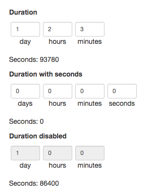

# bootstrap-duration-picker

Javascript library for selecting duration. Target input to which plugin is applied will contain duration in seconds.

[](https://codeclimate.com/github/koss-lebedev/bootstrap-duration-picker)
[](https://badge.fury.io/js/bootstrap-duration-picker)
[](https://badge.fury.io/bo/bootstrap-duration-picker)

## Installation

Using Bower:

    bower install bootstrap-duration-picker

Using NPM:

    npm install bootstrap-duration-picker

Or simply copy `bootstrap-duration-picker.css` and `bootstrap-duration-picker.js` files to your project.

## Example



## Dependencies

- jQuery 1.*
- Bootstrap 3.* (for styling only)

## Usage

```js
$('.duration-picker').durationPicker();

// or

$('.duration-picker').durationPicker({
    lang: 'en',

    // defines whether to show seconds or not
    showSeconds: false,

    // defines whether to show days or not
    showDays: true,

    // callback function that is passed value in seconds every time duration is changed
    onChanged: function (value) {
        console.log(value);
    }
});
```

## License

Please see [LICENSE](LICENSE) for licensing details.
